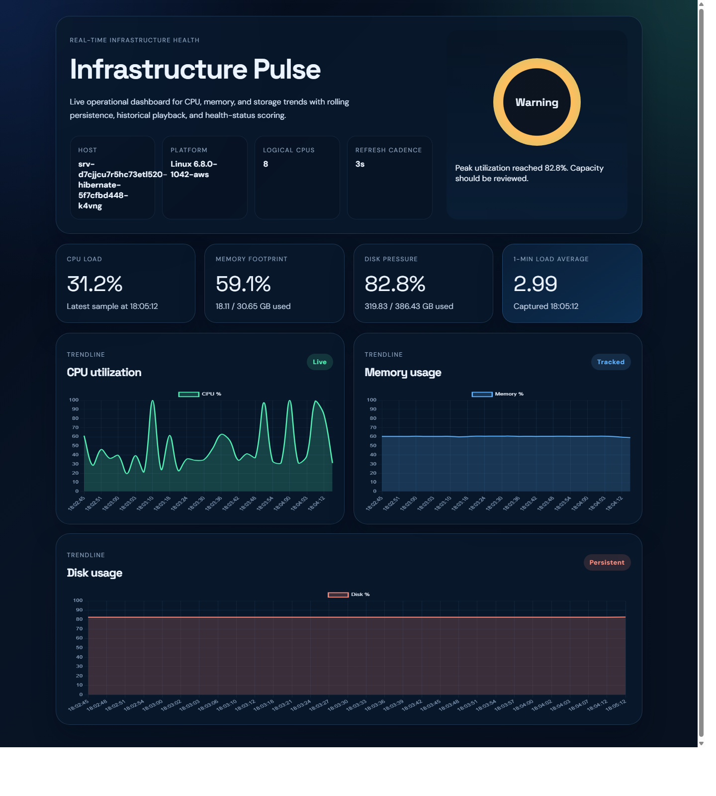

# Infrastructure Pulse

Infrastructure Pulse is a Django-based monitoring dashboard that visualizes live CPU, memory, and disk telemetry for the host machine. It is designed as a portfolio-ready systems project with real-time charts, persistent historical samples, and a polished operations-style interface.

[Live Demo](https://infrastructure-pulse.onrender.com) | [GitHub Repository](https://github.com/kadirzkhan/infrastructure-pulse)

## Dashboard Preview



## Highlights

- Real-time telemetry collection with `psutil`
- Historical snapshot persistence with SQLite
- Unified metrics API for synchronized chart updates
- Health scoring for healthy, warning, and critical states
- Responsive dashboard UI with custom styling and Chart.js visualizations
- Django admin integration for stored telemetry review
- Basic automated tests for the dashboard and APIs

## Stack

- Python
- Django
- SQLite
- psutil
- HTML
- CSS
- JavaScript
- Chart.js

## Local setup

```bash
python -m venv .venv
.venv\Scripts\activate
pip install -r requirements.txt
python manage.py migrate
python manage.py runserver
```

Open `http://127.0.0.1:8000/`.

## Environment variables

- `DJANGO_SECRET_KEY`
- `DJANGO_DEBUG`
- `DJANGO_ALLOWED_HOSTS`
- `DJANGO_TIME_ZONE`

## Deploying live

This repository includes `render.yaml` and `build.sh` for a simple Render deployment.

1. Push the project to GitHub.
2. Create a new web service on Render from the repo.
3. Set `DJANGO_SECRET_KEY` in Render environment variables.
4. Deploy the service and use the generated `.onrender.com` URL.

## Resume talking points

- Built a real-time infrastructure dashboard in Django to monitor host-level CPU, memory, and disk usage.
- Designed a unified telemetry pipeline that stores synchronized snapshots and powers live historical visualizations.
- Improved maintainability by separating backend collection logic from frontend rendering and adding automated API coverage.
